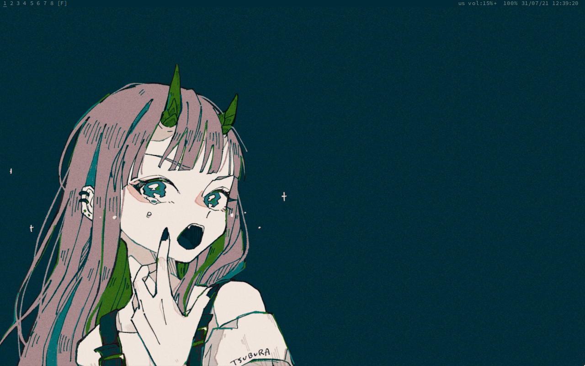

  
## OWN LITTLE WORLD
a collection of my dotfiles

  

#### Daily driver
- **OS**: [Arch linux](https://archlinux.org)
- **WM**: [monsterwm](https://github.com/c00kiemon5ter/monsterwm)/[bspwm](https://github.com/baskerville/bspwm)
- **bar**: [lemonbar](https://github.com/LemonBoy/bar)
- **terminal**: [rxvt-unicode](http://software.schmorp.de/pkg/rxvt-unicode.html)
- **browser**: [qutebrowser](https://www.qutebrowser.org/)
- **editor**: [neovim](https://neovim.io/)
- **other**: [zathura](https://pwmt.org/projects/zathura/),[tmux](https://github.com/tmux/tmux/wiki)
#### Structure
- `./config` - contains actual dotfiles
- `./scripts` - useful scripts
- `./utils` - also scripts but for easier setup
- `./wallpapers` - wallpapers i use
- `./doom.d` - doom emacs setup
- `./other` - other colorschemes
